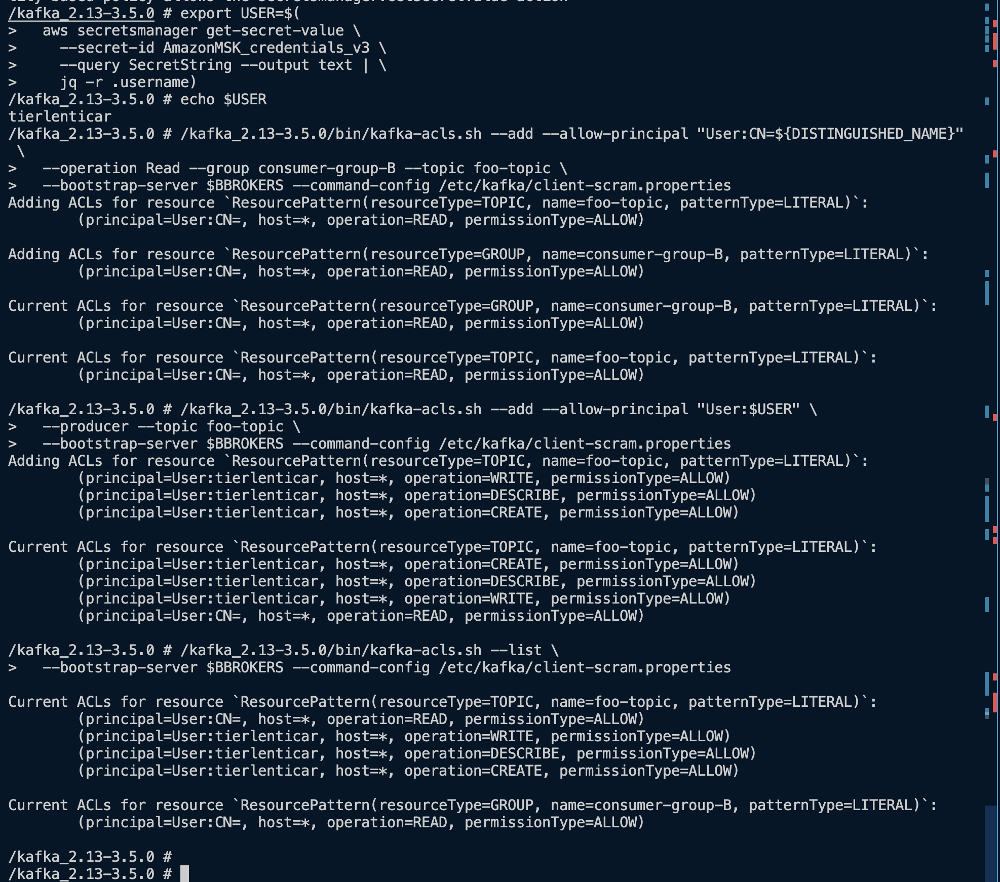
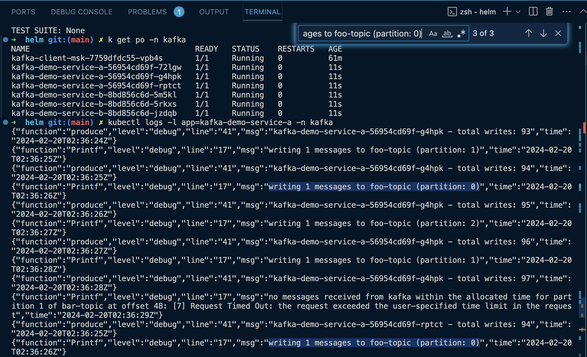

# Terraform, Amazon MSK, and Amazon EKS for Demo

This Terraform project demonstrates the integration of Amazon Managed Streaming for Apache Kafka (Amazon MSK) with Amazon Elastic Kubernetes Service (Amazon EKS) to test Railigent's rail diagnostics and predictive maintenance capabilities.

## Overview

Leveraging Amazon MSK, Railigent can process and analyze vast amounts of rail sensor data in real-time. Combined with Amazon EKS, this setup allows for scalable deployment of microservices that perform diagnostics analysis, anomaly detection, and maintenance scheduling.

## Prerequisites
Ensure you have eksctl, Terraform, AWS CLI v2, and Helm 3 installed and configured for use.

1. EKS Cluster: Deploy the Kubernetes cluster using eksctl, configuring it for application's specific microservices architecture.
2. MSK Cluster: Utilize Terraform to deploy Amazon MSK clusters tailored for handling application's data streaming needs.
3. VPC Peering: Establish a VPC Peering connection between your MSK and EKS VPCs to ensure secure, internal communication.
4. Routing and Security: Update routing tables and security groups to facilitate traffic flow between MSK and EKS components.
5. Update default VPC security groups to allow traffic;
6. IAM Roles for Service Accounts (IRSA): Set up IRSA for secure AWS service access from Kubernetes pods (see [Helm README](helm/kafka-client-go/README.md));
7. Kafka Client Deployment: Deploy a Kafka client within Kubernetes for management and debugging of Kafka topics (see [Helm README](helm/kafka-client/README.md));
8. Configuration: Follow the Kafka Client Configuration guide to optimize the client setup for application's environment (see [Kafka Client Configuration Notes](kafka-config/Install-Kafka-Client.md));

## Helpful AWS CLI Commands for Amazon MSK

```shell
aws kafka list-clusters

aws kafka list-clusters --query 'ClusterInfoList[*].ClusterArn'

aws kafka describe-cluster --cluster-arn <CLUSTER_ARN>

# assuming cluster 0 (first or single cluster)
aws kafka describe-cluster --cluster-arn \
  $(aws kafka list-clusters --query 'ClusterInfoList[0].ClusterArn' --output text)
```

## Terraform

Deploy AWS MSK resources. PLEASE NOTE - this code creates two MSK clusters - one with and one without IAM. You can choose to deploy both or remove Terraform code for either one to prevent its creation.

Original Terraform reference code based on this [Terraform MSK Example](https://registry.terraform.io/providers/hashicorp/aws/latest/docs/resources/msk_cluster#example-usage).

```shell
cd ./tf-msk

terraform validate

terraform plan

terraform apply
```





